/**
* Types of ULM Diagrams 
*   1. Structural UML Diagrams (Deals with struckture of the code)
*       a) Class Diagram
*   2. Behavioural UML Diagrams (Deals with working behavioural or feature of system)
*       a) Use Case Diagram
*/

/** (Behavioural UML Diagrams)
 * 1. Use Case Diagram
 *  a) System Boundary
 *      
 *      E-commerce platform
 *      -------------
 *      ' Feature 1 '          
 *      ' Feature 2 '       
 *      ' Feature 3 '         
 *      '           '
 *      '-----------'
 *       
 *            
    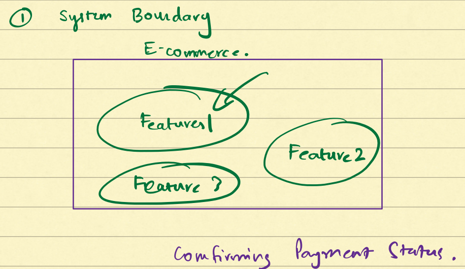

 * b) Use Case
    1. It is function or feature
    2. Labelled as a verb
    3. They are placed inside an oval   
    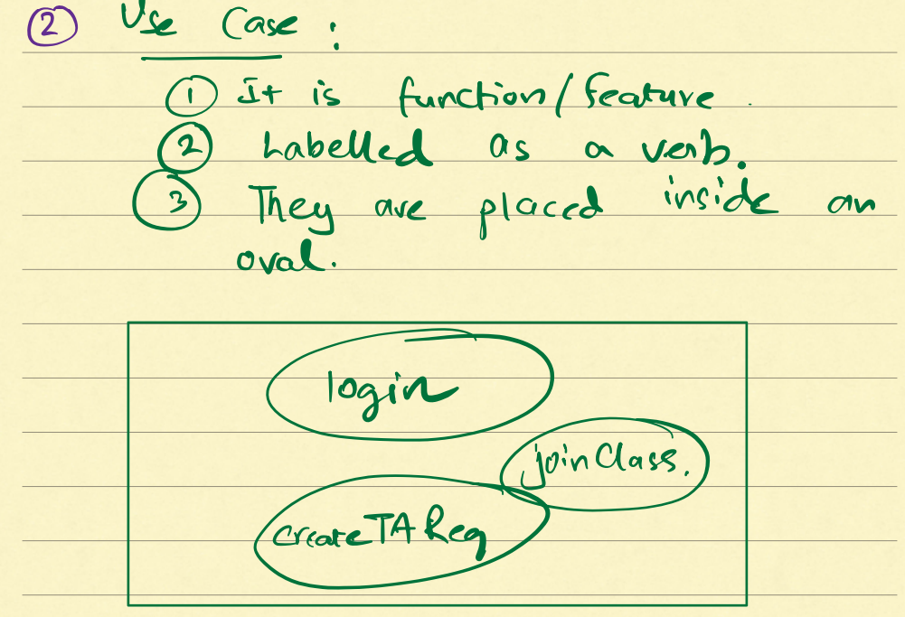

 * c) User/Actor
    1. They are represented by the thik figures
    2. They are nouns
    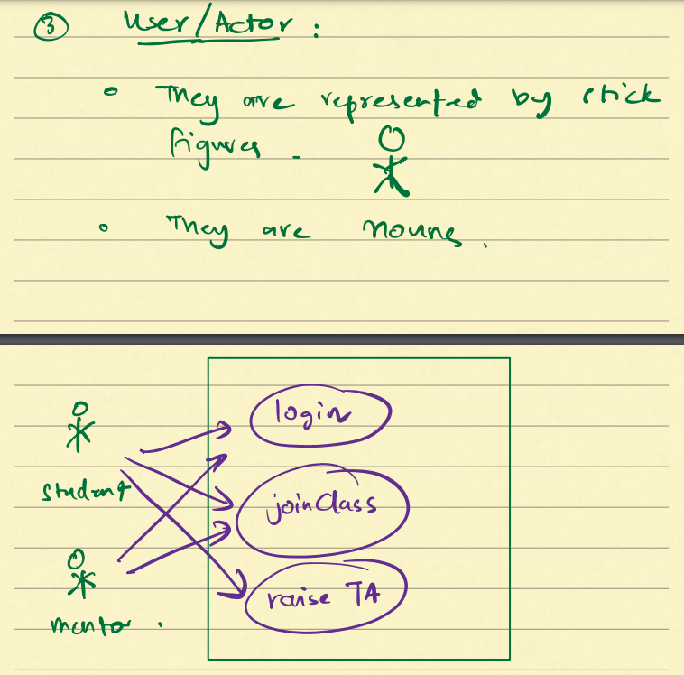

 * d) Includes
    1. How one use case is dependent on another use case
    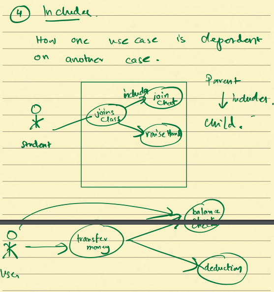

 * d) Extends
    1. When a feature has multiple variants, and a special features extends a several feature
    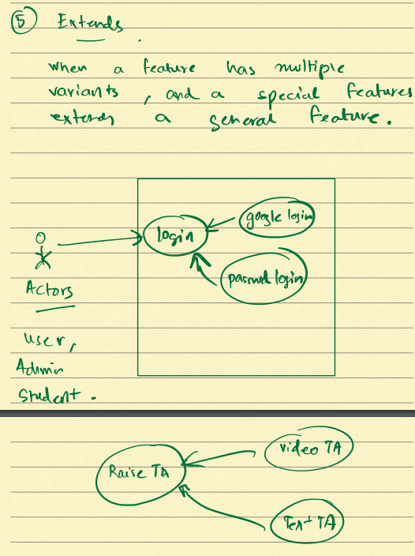

/** (Structural UML Diagrams)
    1. Class Diagram
    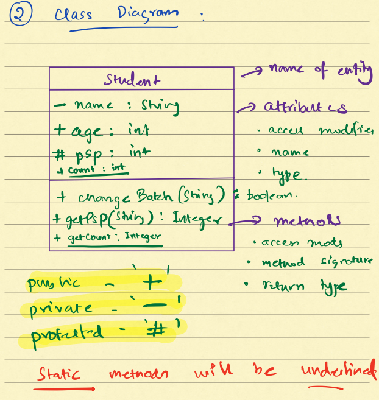

    2. Interface
    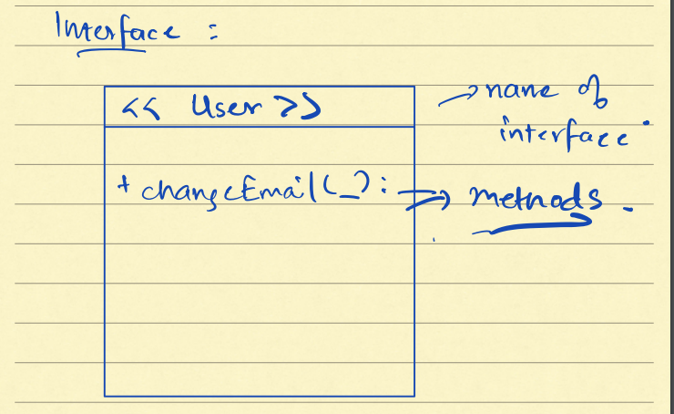

    3. Abstraction
    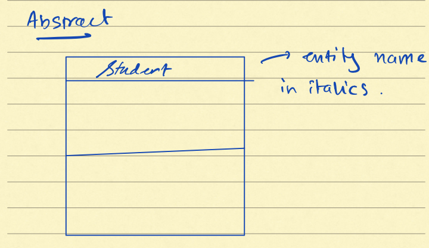

    4. Enums
    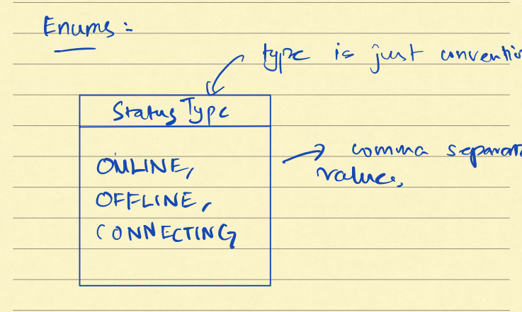

/** Relationship between entities
    1. IS-A relationship
        - Parent child inheritance
        - Implementaiton of interface
    
    2. Association or HAS-A relationship
        - having an attribute of other entirty (Dependency)
        - Association can be of two types
            a) Composition
                - A relationship of two objects where object A exist only if B exist or vice versa.
                - Strong assocaition
            b) Aggregation
                - A relationship of two objects where both the object can exist without each other.
                - weak association 
        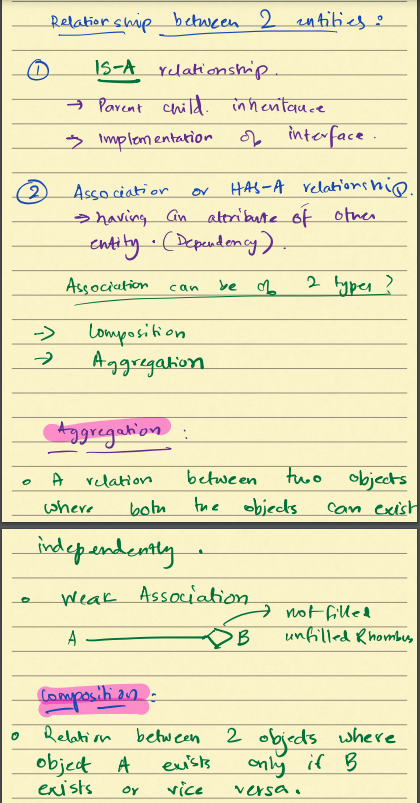

        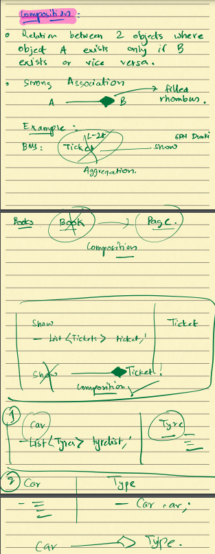